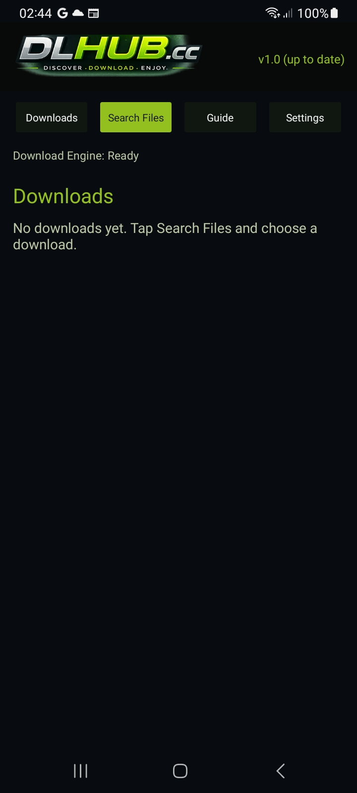
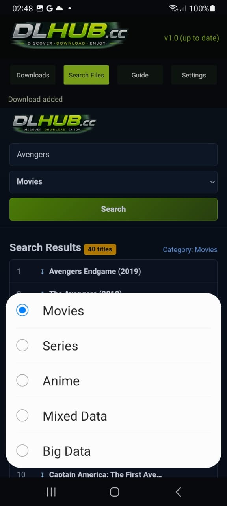
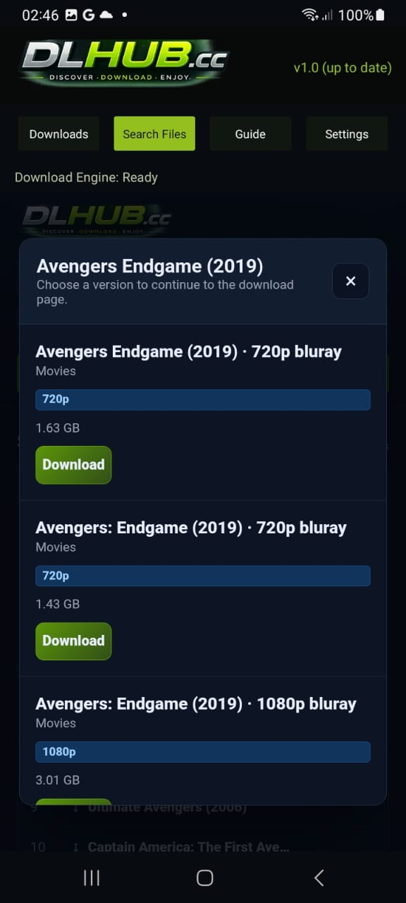
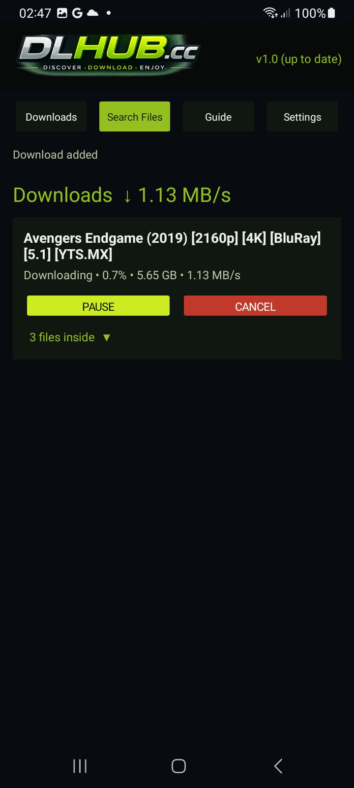
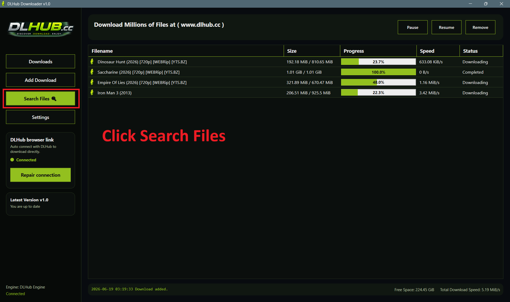
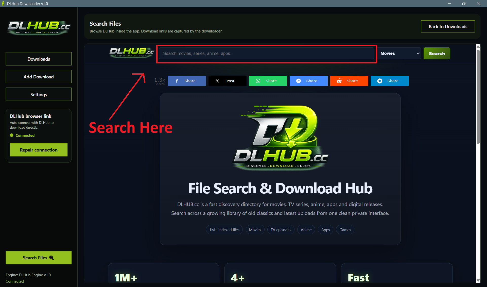
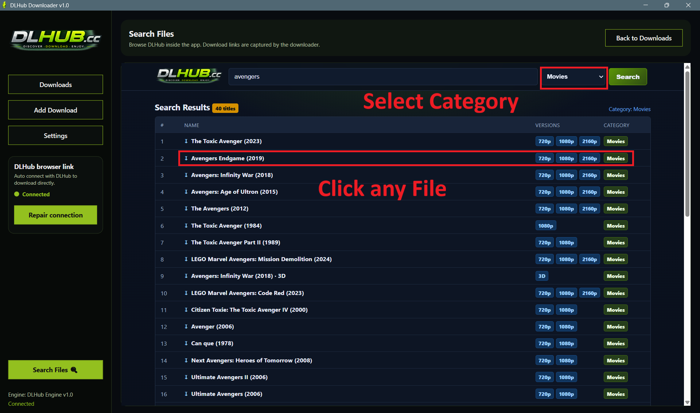
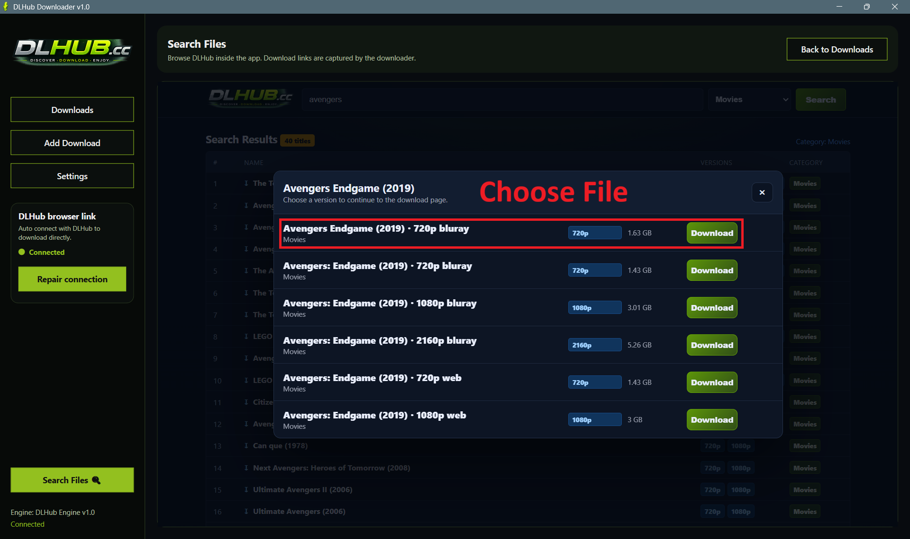

# DLHub.cc Apps

Official Windows and Android applications for **DLHub.cc**

Search • Discover • Download

<!-- DIRECT DOWNLOAD LINKS -->

---

# 🚀 About

DLHub.cc is a fast search and download platform for Windows, Android, and iOS applications.

Millions of indexed files are available through an easy-to-use interface designed for both desktop and mobile users.

---

# ✨ Why DLHub?

- 🔍 Powerful search engine
- ⚡ Fast and lightweight
- 📱 Android application
- 🖥 Windows desktop application
- 🔒 Secure HTTPS connection
- 📂 Millions of indexed files
- 🔄 Regular updates
- 🆓 Free to use

---

# 📱 Android App

The official Android application lets you browse and search DLHub.cc directly from your phone.

## Features

- Fast search
- Lightweight APK
- Clean interface
- Quick downloads
- Secure connection
- Easy installation

### Requirements

- Android 7.0+
- Internet connection

## Installation Guide

---

# 🖥 Windows App

The Windows desktop application provides quick access to DLHub.cc directly from your PC.

## Features

- Fast desktop search
- Lightweight application
- Modern interface
- Quick downloads
- Simple installation
- Optimized for Windows

### Requirements

- Windows 10 / Windows 11
- Internet connection

## Installation Guide

---

# 📦 Current Release

**Latest Version:** **v1.0.0**

| Download | Size |
|----------|-----:|
| 🖥 [Windows Installer (.exe)](https://github.com/sizzlingkenny/DLHub.cc/releases/download/v1.0.0/DLHubDownloader.exe) | 169 MB |
| 🪟 [Windows Portable (.zip)](https://github.com/sizzlingkenny/DLHub.cc/releases/download/v1.0.0/DLHubDownloaderWindows.zip) | 67.8 MB |
| 📱 [Android APK](https://github.com/sizzlingkenny/DLHub.cc/releases/download/v1.0.0/DLHubDownloaderAndroid.apk) | 7.64 MB |

---

# 🌐 Official Links

**Website**

https://dlhub.cc

**GitHub Repository**

https://github.com/sizzlingkenny/DLHub.cc

---

# 🛡 Security

For your safety, download DLHub.cc applications **only** from:

- https://dlhub.cc
- https://github.com/sizzlingkenny/DLHub.cc

---

# 🐞 Support

Found a bug or have a feature request?

Open an Issue in this repository and we'll investigate it.

---

# 📄 License

Copyright © DLHub.cc

All rights reserved.

---

## DLHub.cc

### Search • Discover • Download

Made with ❤️ for Windows & Android users.

